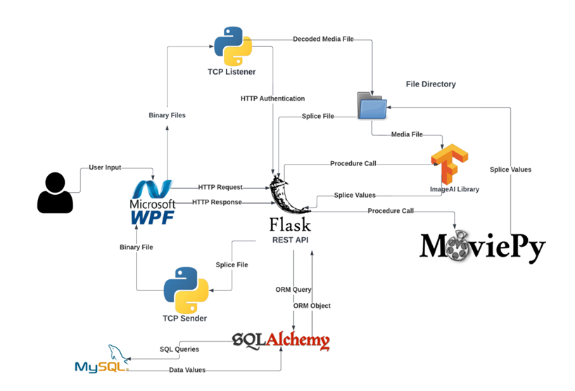
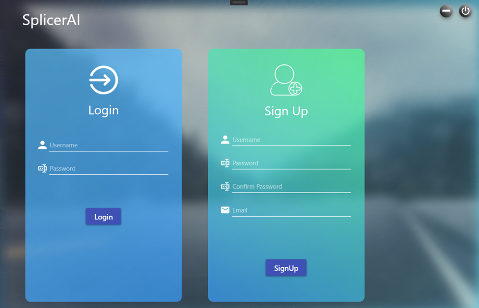
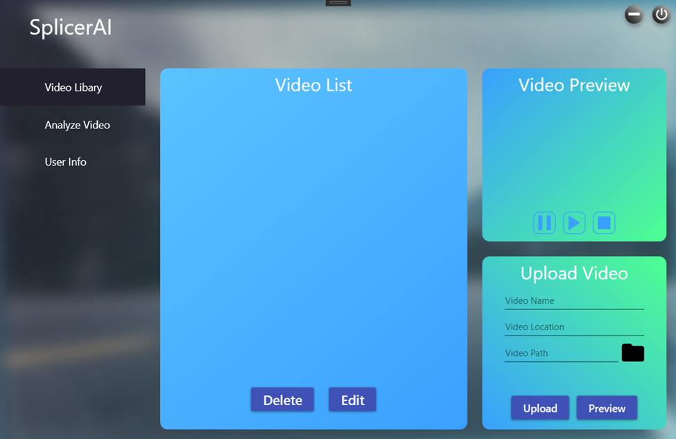
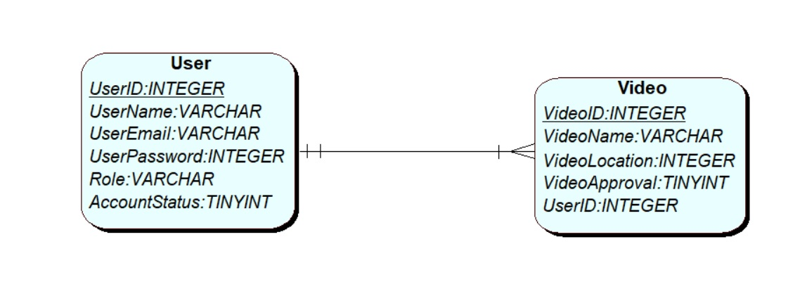

# Video-splicing Client-Server Solution

## Description
This project includes a total client-server solution which allows client to upload a video to the server. After uploading the video to the server, the client can specify the labels according to which the video is to be spliced like car, bus etc. The backend implementation then takes this particular information, processes the video and returns the splices back to the client application which provides a UI for you to see through all the video splices.

## Technology used
* C#, WPF and .net core for frontend development.
* Python, Flask and SQL Alchemy for backend implementation.
* Moviepy a python library for breaking down the video into splices.
* ImageAI, a python library built on top of tensorflow for implementing the CNN model.


## Project Structure

The following diagram illustrates various components of the project and how they interact with each other to create the whole system.


*fig - project breakdown*

## Implementation

When I made the project, it was developed as as a prototype, therefore, the implementation of the project was a bit convoluted as I lacked experience in dealing with docker containers back then. In hindsight, I would probably contanerize every components within docker rather than mixing up local host and docker if I were to do it again. The implementation involves the following:

### Database Implementation
The database was implemented as a MySQL container in docker. with a specific port number and exposed to the host machine.

### Rest API
The backend was setup in local machine by installing python and PIP and installing all the required dependencies through PIP.

### Listeners and senders for file transfer
Something I realized throughout the course of developing this project is how restAPI wasn't suited for transfer of heavy files like video. For this I had to explore file transfer using TCP. There is both TCP senders and listeners implemented. The TCP sender is integrated with the front-end itself, however, the TCP listener is implemented as a different process to the REST API. However, the current version of the implementation although it verifies the user with their credential before recieving the data doesn't have implementation ot secure the confidentiality of the data during the transfer.

### Front-end client
The front-end client utilizes WPF technology with .NET core library to provide users with various functionality to leverage the service provided by the rest API and other backend services. The functionality includes being able to log in, uploading the video, analyzing the video and previewing the analyzed splices.


*fig - Frontend index page*


*fig - Video Library view*

### Rest-API
The REST-API is responsible for handling the bulk of user requests. All the process of creating users, uploading video and deleting video, etc are handled by the REST API. In hindsight, the current REST API isn't a good implementation as it performs more activities than just state changes in database. It would be better to utilize an asynchronous background process or service to carry out this activity to make the REST API more efficient.

## Setting up the solution
### MySQL
To setup the database:
1. Install Docker
2. Enable Hyper-V.
3. Run the provided DDL scripts to set up the required database structures.


*fig - Entities structure*

### Flask Backend
To setup the rest-api and other backend elements:
1. Install python
2. Install PIP
3. Find the requirements.txt file in the backend folder and run the following command.

    ```powershell
    pip install -r requirements. txt
    ```
4. Run the flask app using the associated script.

    ```
        python <script>.py
    ```

### Frontend WPF
The source code of the WPF client is already given. You can create the front-end application in your machine with following steps:

1. Install VS.
2. Create a new WPF project.
3. Import the xaml and cs files to your project.
4. Resolve dependencies of the application using "Manage Nuget Packages" by right-clicking on the project.
5. Compile the application using dot net command line tools.
6. Run the application.